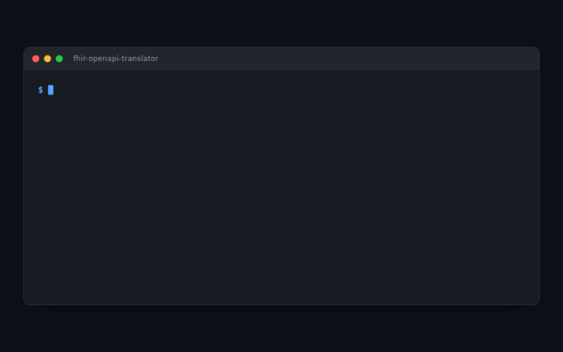

# fhir-openapi-translator

**Turn any FHIR resource into an OpenAPI spec — and generate typed models in any language.**

[](https://github.com/krishgok/fhir-openapi-translator/actions/workflows/ci.yml)
[](LICENSE)
[](https://nodejs.org)
[](https://hl7.org/fhir)



HAPI FHIR and Firely give Java/.NET teams great FHIR models. Everyone else — Go, Rust, Kotlin, PHP, C++, TypeScript — has no equivalent. But every language has an OpenAPI code generator. This tool bridges the gap: give it a resource name and a FHIR version, get back a clean, self-contained OpenAPI document ready for `openapi-generator`.

## Install

```sh
npm install fhir-openapi-translator     # library + `fhir-oas` CLI
```

Node.js ≥ 20. FHIR definitions ship with the package — no network, no server.

## Quick start

```sh
# One resource, or many
fhir-oas generate Patient --fhir-version r4 -o patient.yaml

# Then generate a client in any language
npx @openapitools/openapi-generator-cli generate \
  -i patient.yaml -g typescript-fetch -o ./client \
  --additional-properties=modelPropertyNaming=original
```

That's a complete spec — the `Patient` schema, its full dependency closure, the standard REST interactions, and every official search parameter — that any OpenAPI generator turns into typed models and clients.

## Usage

```sh
# Target OpenAPI 3.1 as JSON (default is 3.0.3 YAML, for widest codegen support)
fhir-oas generate Patient -f r5 --openapi-version 3.1 --format json -o patient.json

# Add the standard operations ($everything, $validate, ...)
fhir-oas generate Patient -f r4 --operations

# Apply an Implementation Guide profile (e.g. US Core)
fhir-oas generate Patient -f r4 --ig hl7.fhir.us.core@5.0.1 --profile us-core-patient

# Match one server's declared surface (reads its /metadata)
fhir-oas generate -f r4 --capability https://server.example.org/fhir

# Merge into an existing spec, preserving comments and key order
fhir-oas generate Questionnaire -f r4 --merge-into api.yaml

# CI drift guard: fail if a committed spec no longer matches generation
fhir-oas check Patient Observation -f r4 --file api.yaml

# List resources for a version, or profiles in an IG package
fhir-oas list --fhir-version r4b
```

```ts
import { generateOpenApi } from "fhir-openapi-translator";
const doc = generateOpenApi({ resources: ["Patient"], fhirVersion: "r4" });
```

## What it does

- **FHIR R4, R4B, R5** → **OpenAPI 3.0.3 or 3.1.0**, YAML or JSON.
- **Minimal output** — only the resources you ask for and what they reference.
- **Typed code enums** from required ValueSet bindings, not bare strings.
- **Custom operations** from the official OperationDefinitions.
- **Profiles / IGs** — apply US Core-style constraints from any IG package.
- **CapabilityStatement-driven** — generate exactly what a server supports.
- **Merge mode & drift guard** — coexist with hand-written specs, catch drift in CI.

## Where it fits

|  | fhir-openapi-translator | HAPI / Firely |
|---|:---:|:---:|
| Output | OpenAPI (→ any language) | Java / .NET models |
| Runtime needed | none (offline CLI) | a running server / SDK |
| US Core / IG profiles | ✅ | ✅ |
| Per-resource, codegen-tuned specs | ✅ | — |

**Complements a FHIR SDK, doesn't replace it.** Keep HAPI or Firely for server-side models and conformance — this produces the OpenAPI contract around them: for consumers in any language, and for the tooling you already run (gateways, mock servers, contract tests).

## Docs

- **[Reference](docs/REFERENCE.md)** — full CLI, library API, codegen recipes, limitations
- **[Examples](examples/)** — worked walkthroughs for each feature

## Legal & attribution

- **FHIR®** is a registered trademark of [Health Level Seven International (HL7®)](https://www.hl7.org). This project is **not affiliated with, endorsed by, or sponsored by HL7**; the name is used only to describe what the tool consumes.
- Bundled definitions derive from the official HL7 FHIR packages (the FHIR specification is published under [CC0 / public domain](https://build.fhir.org/license.html)) and [`@medplum/definitions`](https://www.npmjs.com/package/@medplum/definitions) (Apache-2.0). IG packages you pass to `--ig` are licensed by their own publishers.
- Generated specs describe the FHIR data model but do **not** guarantee FHIR conformance — validate payloads with a real FHIR validator. See [limitations](docs/REFERENCE.md#assumptions-and-known-limitations).

## License

[MIT](LICENSE)
